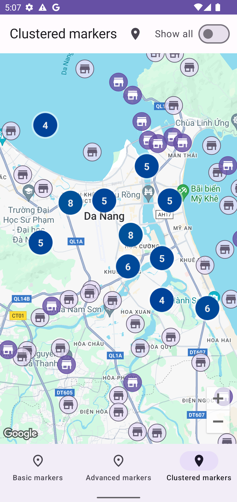

# More with maps in your Android app with Jetpack Compose (Kotlin)

***This is a hands-on tech session where you'll explore efficient management of large datasets
through marker clustering, harness the aesthetic appeal of advanced markers.
You also will discover how to use Maps with Jetpack Compose to create engaging and high-performing
map features.

## Youtube video

https://www.youtube.com/live/kyOiF010rDc?si=22ooH2ieeszCth3V&t=2774

## Screenshots

| Basic Markers                   | Advanced Markers                      | Marker Clustering                       |
|---------------------------------|---------------------------------------|-----------------------------------------|
|  |  |  |
